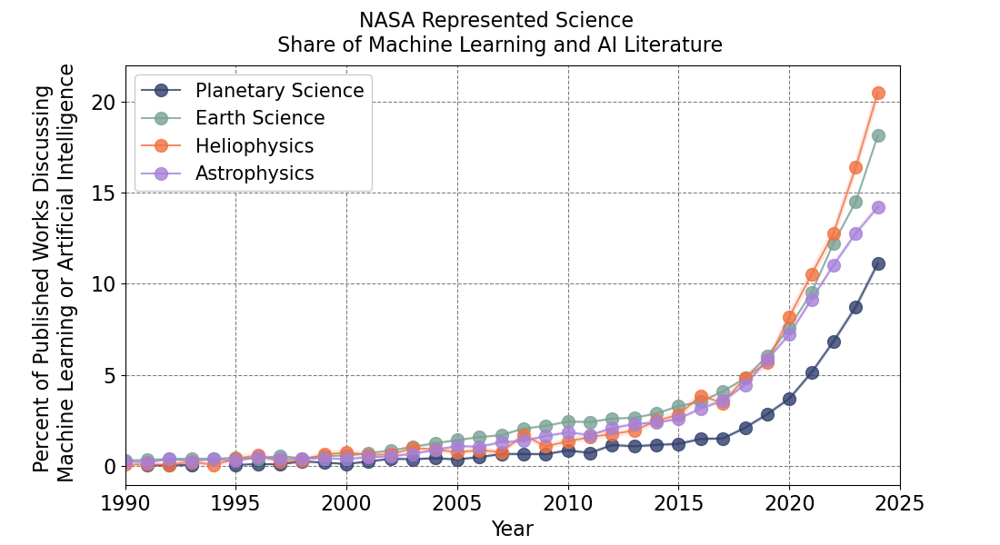

### Machine Learning and Artificial Intelligence Publications in NASA Represented Scientific Fields

[](https://zenodo.org/doi/10.5281/zenodo.13023913)

This is a collection of code that creates a preliminary analysis of the prevalence of machine learning in NASA science related literature. The original data source can be found at the Scopus literature [database](https://www.scopus.com/home.uri).

The figure here was first computed for [Azari et al., 2021](https://baas.aas.org/pub/2021n4i128/release/1?readingCollection=7272e5bb) and has since been updated. As based on this figure, it is estimated that currently (in 2024) planetary science has seen roughly half (60%) as many applications of machine learning methods as in Earth science (11.1% vs 18.1% of publications).

The search terms regarding fields were updated in 2024 to include:
- artificial intelligence as a search term in addition to machine learning; the exact search terms can be found in the data files
- an approximate estimate of uncertainties (via Poisson counting statistics)
- expanded field definitions in recognition that scientists do not identify in papers as "planetary science" but are more likely to use "planetary geology" etc  

If you use this figure please reference the published paper and specify the version of the repository used for generating the figure (Azari et al., 2021, v2024). Sample Bibtex of the paper is given below.

```
@article{Azari2021,
author = {Azari, A and Biersteker, J. B. and Dewey, R. M. and Doran, G. and Forsberg, E. J. and
Harris, C. D. K. and Kerner, H. R. and Skinner, K. A. and Smith, A. W. and Amini, R. and
Cambioni, S. and Da Poian, V. and Garton, T. M. and Himes, M. D. and Millholland, S. and Ruhunusiri, S.},
journal = {Bulletin of the AAS},
number = {4},
year = {2021},
publisher = {Bulletin of the AAS},
title = {Integrating Machine Learning for Planetary Science: {P}erspectives for the Next Decade},
volume = {53},
doi = {10.3847/25c2cfeb.aa328727}
}
```

#### Current Figure (version 2024)


