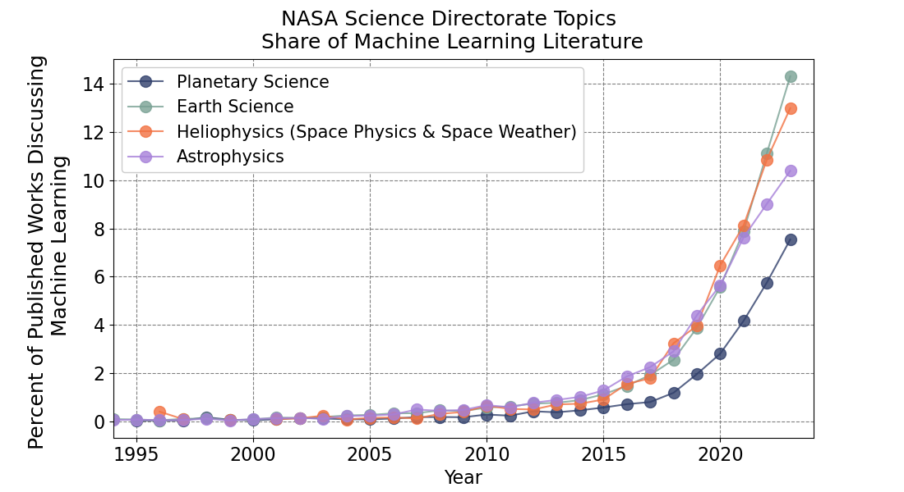

### Machine Learning Publications in NASA Represented Fields

[](https://zenodo.org/doi/10.5281/zenodo.13023913)

This is a collection of scripts that analyze the prevalence of machine learning in NASA science related literature. The original data source can be found at the Scopus literature [database](https://www.scopus.com/home.uri).

The figure here was first computed for [Azari et al., 2021](https://baas.aas.org/pub/2021n4i128/release/1?readingCollection=7272e5bb) and has since been updated. As based on this figure, it is estimated that currently (in 2023) planetary science has seen approximately half as many applications of machine learning methods as in Earth science (7.5% vs 14.3% of publications).

If you use this figure please reference the published paper and specify the version of the respository used for example (Azari et al., 2021, v2023.0.2). Sample Bibtex is given below.

```
@article{Azari2021,
author = {Azari, A and Biersteker, J. B. and Dewey, R. M. and Doran, G. and Forsberg, E. J. and
Harris, C. D. K. and Kerner, H. R. and Skinner, K. A. and Smith, A. W. and Amini, R. and
Cambioni, S. and Da Poian, V. and Garton, T. M. and Himes, M. D. and Millholland, S. and Ruhunusiri, S.},
journal = {Bulletin of the AAS},
number = {4},
year = {2021},
publisher = {Bulletin of the AAS},
title = {Integrating Machine Learning for Planetary Science: {P}erspectives for the Next Decade},
volume = {53},
doi = {10.3847/25c2cfeb.aa328727}
}
```

#### Current Figure (version 2023.0.2)


